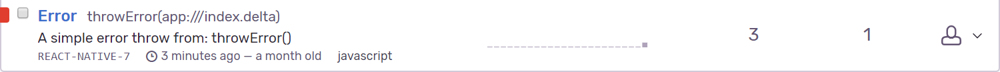

# Sentry (React Native)

Steps:
* npm install --save react-native-sentry
* react-native link

Create your account on sentry:  https://sentry.io/auth/login/

Start a new project on sentry for react native.
Then add following lines to your `index.js`  

`import { Sentry } from "react-native-sentry";`  
`Sentry.config("YOUR KEY").install();`

Now in order to check whether sentry is configured explicitly throw an error and check it on the Sentry dashboard.

Example - On crash

Example - To log events on basis of their severity

